# 数据获取与融合规格书

> **文档目的**：定义数据获取、提取、融合的完整流程和技术规范，作为数据准备工作的权威依据。

---

## 1. 概述

### 1.1 目标

本系统需要从历史书籍（如《史记》《汉书》等）中提取结构化数据（人物、地点、事件、关系），并支持：
- 从多个数据源提取同一条目的信息
- 智能融合重复数据，形成完整、准确的记录
- 完整记录所有数据变更，支持版本历史和追溯

### 1.2 核心原则

1. **LLM 驱动**：使用 LLM 进行智能判断和融合，而非硬编码规则
2. **可追溯性**：所有数据变更都有完整的版本历史
3. **可解释性**：融合决策提供原因和置信度
4. **人工审核**：所有数据最终需要人工审核确认

### 1.3 数据提取与发布全流程

```mermaid
flowchart TD
    Start([开始]) --> GetRaw["获取原始文本<br/>维基文库/ctext.org"]
    GetRaw --> SaveRaw["保存原始文本<br/>data/raw/"]
    
    SaveRaw --> Preprocess["数据预处理<br/>preprocess_text.js"]
    Preprocess --> StructJSON["生成结构化JSON<br/>包含段落信息"]
    
    StructJSON --> UploadChapter["上传章节<br/>POST /api/admin/chapters/import"]
    UploadChapter --> ChapterDB[章节保存到数据库]
    
    ChapterDB --> ExtractChoice{选择提取方式}
    ExtractChoice -->|手动提取| ManualExtract["章节处理页面<br/>点击开始提取"]
    ExtractChoice -->|自动提取| AutoExtract["上传时自动提取<br/>可选参数 autoExtract"]
    
    ManualExtract --> LLMExtract["LLM 提取数据<br/>POST /api/admin/chapters/:id/extract"]
    AutoExtract --> LLMExtract
    
    LLMExtract --> ExtractPerson[提取人物]
    LLMExtract --> ExtractPlace[提取地点]
    LLMExtract --> ExtractEvent[提取事件]
    LLMExtract --> ExtractRel[提取关系]
    
    ExtractPerson --> CreateReview["自动创建 ReviewItem<br/>状态: PENDING"]
    ExtractPlace --> CreateReview
    ExtractEvent --> CreateReview
    ExtractRel --> CreateReview
    
    CreateReview --> QuickMatch["快速匹配<br/>姓名/别名匹配"]
    QuickMatch -->|有匹配| LLMJudge["LLM 判断重复<br/>判断是否同一实体"]
    QuickMatch -->|无匹配| ReviewQueue[进入审核队列]
    
    LLMJudge -->|"shouldMerge=true<br/>confidence>=0.7"| MarkDuplicate["标记为重复<br/>记录匹配记录ID"]
    LLMJudge -->|"shouldMerge=false<br/>或 confidence<0.7"| ReviewQueue
    
    MarkDuplicate --> ReviewQueue
    
    ReviewQueue --> HumanReview[人工审核<br/>章节处理页面或 Review 页面]
    HumanReview -->|拒绝| Reject["标记 REJECTED<br/>记录拒绝原因"]
    HumanReview -->|批量通过| BatchApprove["批量通过审核<br/>POST /api/admin/review/batch-approve"]
    HumanReview -->|单个通过| SingleApprove["单个通过审核<br/>POST /api/admin/review/items/:id/approve"]
    
    BatchApprove --> CheckMerge{是否检测到<br/>重复?}
    SingleApprove --> CheckMerge
    
    CheckMerge -->|是| LLMMerge["LLM 融合<br/>生成合并数据"]
    CheckMerge -->|否| CreateNew[创建新记录<br/>status: PUBLISHED]
    
    LLMMerge --> MergeDecision{融合决策}
    MergeDecision -->|确认合并| UpdateExisting["更新已有记录<br/>status: PUBLISHED"]
    MergeDecision -->|拒绝合并| CreateNew
    
    CreateNew --> RecordChange["记录变更日志<br/>Action: CREATE"]
    UpdateExisting --> RecordChangeMerge["记录变更日志<br/>Action: MERGE/UPDATE<br/>记录 mergedFrom"]
    
    RecordChange --> End([完成<br/>数据已发布])
    RecordChangeMerge --> End
    Reject --> End
    
    style GetRaw fill:#e1f5ff
    style LLMExtract fill:#fff4e1
    style LLMJudge fill:#fff4e1
    style LLMMerge fill:#fff4e1
    style HumanReview fill:#ffe1f5
    style BatchApprove fill:#ffe1f5
    style SingleApprove fill:#ffe1f5
    style RecordChange fill:#e1ffe1
    style RecordChangeMerge fill:#e1ffe1
    style CreateNew fill:#e1ffe1
    style UpdateExisting fill:#e1ffe1
```



---

## 2. 数据获取流程

### 2.1 整体流程

```
原始文本 → 预处理 → 上传章节 → [可选]自动提取 → Review 审核 → 发布（审核通过即发布）
```

**简化后的流程**：
1. **上传章节**：在管理后台上传章节 JSON 文件
2. **提取数据**：在章节处理页面手动触发提取，或上传时自动提取
3. **批量审核**：在章节处理页面或 Review 页面批量审核，通过后直接发布
4. **完成**：数据状态为 PUBLISHED，可直接使用

### 2.2 步骤 1：获取原始文本

**数据来源**：
- 维基文库（https://zh.wikisource.org）
- 中国哲学书电子化计划（https://ctext.org）

**文件格式**：
- UTF-8 编码的文本文件
- 保存路径：`data/raw/{book}/{book}_{chapter}_{title}.txt`

**文件命名规范**：
- 格式：`{book}_{chapter}_{title}.txt`
- 示例：`shiji_01_gaozu_benji.txt`

**文件内容要求**：
- 文件开头应包含来源信息：
  ```
  来源：《史记·高祖本纪》
  获取渠道：维基文库 (https://zh.wikisource.org/wiki/史記/卷008)
  获取日期：2024-12-01
  版权状态：公共领域（Public Domain）
  ```

### 2.3 步骤 2：数据预处理

**目的**：将原始文本转换为结构化格式

**输出格式**：JSON
```json
{
  "title": "高祖本纪",
  "source": {
    "book": "史记",
    "chapter": "高祖本纪",
    "url": "https://zh.wikisource.org/wiki/史記/卷008"
  },
  "paragraphs": [
    {
      "order": 1,
      "text": "段落内容...",
      "id": "para_1"
    }
  ]
}
```

**工具**：
- `scripts/preprocess_text.js` - 自动预处理脚本（Node.js 版本）

### 2.4 步骤 3：LLM 提取

**提取类型**：
1. **人物（Person）**
2. **关系（Relationship）**
3. **地点（Place）**
4. **事件（Event）**

**提取方式**（推荐使用系统内提取）：
- **系统内提取**（推荐）：
  - 在管理后台的"章节处理"页面手动触发提取
  - API：`POST /api/admin/chapters/:id/extract`
  - 提取结果自动创建 ReviewItem
- **自动提取**（可选）：
  - 上传章节时设置 `autoExtract: true` 参数
  - 章节上传后自动提取
- **线下脚本**（保留，用于离线处理）：
  - `scripts/extract_with_llm.py` - LLM 提取脚本
  - `scripts/extract_data.sh` - 批量提取脚本
  - 提取后需要手动上传到系统

**输出格式**：
```json
{
  "extractedAt": "2024-12-01T10:00:00",
  "sourceFile": "data/raw/shiji/shiji_01_gaozu_benji.txt",
  "type": "person",
  "count": 21,
  "data": [
    {
      "name": "刘邦",
      "aliases": ["高祖", "沛公"],
      "role": "EMPEROR",
      "biography": "...",
      ...
    }
  ]
}
```

**LLM 配置**：
- 支持 OpenAI 和 Google Gemini
- 默认模型：OpenAI `gpt-4o-mini` 或 Gemini `gemini-2.5-flash`（主用）
- Temperature: 0.3（保证输出稳定性）

#### 2.4.1 提取策略选择
- **独立提取**：人物/地点/关系/事件分别调用，提示短、可并行；缺点是跨实体一致性依赖后处理。
- **完全联合**：一次输出全部实体与关联；一致性好但提示和输出膨胀，易截断、难调试。
- **混合模式（推荐）**：以事件为中心联合提取（事件 + 关联人物/地点/关系），再用独立提取补全全量人物/地点，并通过对齐/消歧回填一致引用。兼顾一致性与覆盖率。

#### 2.4.2 混合模式流程（事件为中心）

**事件提取采用两阶段流程，确保关键事件（如主角生死）不被遗漏：**

1. **分段/滑窗输入**：按段落或固定 Token 窗口，将文本切块。

2. **事件提取（两阶段）**：
   - **第一阶段：提取事件概览**
     - 快速提取所有事件的基本信息（名称、时间、重要程度）
     - 评估每个事件的重要程度（L1-L5）
     - 确保所有 L1 事件（如主角生死、改朝换代）都被识别
   - **第二阶段：提取事件详情**
     - 按重要程度排序（L1 > L2 > L3）
     - 分页提取详细信息（摘要、参与者、地点等）
     - 优先保证 L1 事件的完整提取

3. **人物/地点补全**：用独立提取再跑一遍全量人物、地点，补齐零散实体。

4. **对齐与消歧**：基于名称/别名快速匹配，疑似重复交给 LLM 判断；生成 canonical 实体 ID。

5. **回填引用**：将事件中的 actors、locations、关系引用映射到 canonical ID（匹配失败则保留未匹配状态，留待人工审核）。

6. **创建 ReviewItem**：事件、人物、地点、关系均进入审核队列，携带匹配/消歧结果。

**重要程度分级标准（L1-L5）**：
- **L1（最高优先级，必须包含）**：改朝换代、决定性重大战役、主角/核心人物的生死、影响历史进程的关键决策
- **L2（高优先级）**：重要政治事件、重大军事行动、影响地区或国家局势的事件
- **L3（中优先级）**：重要人物生死（非主角）、关键转折点、影响主要人物命运的事件
- **L4（低优先级，可选）**：一般战役、次要政治事件、局部冲突
- **L5（最低优先级，不提取）**：个人琐事、日常事务、无关紧要的事件

#### 2.4.3 联合事件输出格式（示例）
```json
{
  "extractedAt": "2024-12-01T10:00:00",
  "type": "event_joint",
  "count": 8,
  "data": [
    {
      "name": "鸿门宴",
      "type": "MILITARY",
      "timeRangeStart": "前206年",
      "timeRangeEnd": null,
      "location": { "name": "鸿门" },
      "actors": [
        { "name": "刘邦", "role": "PROTAGONIST" },
        { "name": "项羽", "role": "OPPOSING" },
        { "name": "范增", "role": "ADVISOR" }
      ],
      "relationships": [
        { "sourceName": "项羽", "targetName": "刘邦", "type": "HOSTILE", "description": "宴请实为试探与威慑" }
      ],
      "summary": "项羽设宴试探刘邦，范增示意要杀，樊哙闯帐解围。",
      "impact": "刘邦脱身，楚汉冲突升级",
      "importance": "L3",
      "relatedParagraphs": ["para_12", "para_13"]
    }
  ]
}
```

**字段约束**：
- 每批事件不超过 10 条；`summary/impact/description` 控制在 200 字以内。
- `actors.role` 建议枚举：`PROTAGONIST|ALLY|OPPOSING|ADVISOR|OTHER`。
- `relationships.type` 复用关系类型枚举，未匹配 ID 时用 `sourceName/targetName`。
- `importance` 必须为 `L1|L2|L3|L4|L5` 之一，用于事件筛选和排序。
- 允许缺省 `location`（未知时留空）。

#### 2.4.4 人物/地点补全输出格式（示例）
- **人物补全**（独立提取）：
```json
{
  "type": "person",
  "count": 15,
  "data": [
    {
      "name": "刘邦",
      "aliases": ["高祖", "沛公"],
      "role": "EMPEROR",
      "biography": "汉朝开国皇帝，出身沛县亭长。",
      "keyEvents": ["鸿门宴"]
    }
  ]
}
```
- **地点补全**（批量提取）：
```json
{
  "type": "place",
  "count": 6,
  "data": [
    {
      "name": "鸿门",
      "aliases": ["鸿门堡"],
      "modernLocation": "陕西省西安市临潼区骊山北麓",
      "modernAddress": "鸿门宴遗址",
      "geographicContext": "位于骊山北麓，是楚汉相争早期的重要地点，战略位置关键。",
      "featureType": "地名/军事节点",
      "coordinates": {
        "lng": 109.2,
        "lat": 34.4
      }
    }
  ]
}
```
**补全要求**：
- 批量处理：所有地点一次性发送给 LLM，而不是逐个处理
- 跳过已有地点：如果地点已存在于数据库，直接跳过，不进行任何处理（MVP 阶段不考虑融合）
- 数据源合并：结合 CHGIS 的准确坐标和 LLM 的丰富地理信息

#### 2.4.5 对齐与消歧（人物/地点/关系）

**核心策略**：在提取人物和地点之前，先获取已有的 Person 和 Place 数据，将它们传给 LLM，让 LLM 判断是否需要更新/完善。

**人物处理流程**：
1. **提取事件**：先从文本中提取事件（事件中包含人物名称）
2. **获取已有数据**：查询数据库中已有的 Person，通过名称/别名快速匹配
3. **LLM 完善**：将已有数据和新提取的文本一起传给 LLM，让 LLM 判断是否需要更新/完善
4. **进入审核**：完善后的数据进入 ReviewItem 审核流程

**地点处理流程**（批量优化）：
1. **提取事件**：从事件中收集所有地点名称
2. **过滤已有地点**：批量查询数据库，找出已存在的地点（MVP 阶段：已存在的地点直接跳过，不进行融合）
3. **CHGIS 查询**：对不存在的地点逐个查询 CHGIS API（获取坐标和现代位置）
4. **批量 LLM 增强**：将所有新地点一次性发送给 LLM，传入 CHGIS 查询结果：
   - 即使有 CHGIS 数据，也调用 LLM 获取更丰富的地理信息（地理背景、战略意义等）
   - LLM 基于 CHGIS 的坐标信息和文本内容，生成完整的地点信息
5. **数据合并**：将 CHGIS 的坐标信息与 LLM 的丰富信息合并：
   - 坐标信息：优先使用 CHGIS 的坐标（如果存在且准确）
   - 地理背景：使用 LLM 生成的地理背景
   - 现代位置：优先使用 CHGIS，LLM 补充
   - 其他字段：LLM 生成
6. **进入审核**：合并后的数据进入 ReviewItem 审核流程

**优势**：
- **性能提升**：地点处理从 N 次 LLM 调用减少到 1 次批量调用
- **信息更丰富**：即使有 CHGIS 数据，也获取 LLM 的地理背景信息
- **数据质量**：结合 CHGIS 的准确坐标和 LLM 的丰富描述
- **简化逻辑**：MVP 阶段不考虑融合，已存在地点直接跳过

#### 2.4.6 分段/批处理与质量控制
- **分段策略**：按段落或 ~4k-6k tokens 窗口滑动；章节很长时可用 8k-12k tokens；窗口重叠 5-10% 以避免切断事件。若使用 200k context，可在高优先章节尝试更大窗口，但仍建议分批以便并行、溯源和重试。
- **输出上限**：每调用事件≤30条，人物≤60条，地点≤60条；超出时要求模型“按重要性截断”，并标记被截断的事件/实体名称便于后补。
- **字段长度**：`summary/impact/description/biography` 建议 300-400 字，要点式。
- **截断防护**：提示中要求“若不确定则留空，不要杜撰”；超长输入优先减去无关上下文。
- **性能**：并行独立提取；对相同输入缓存 LLM 结果；速率限制遵循提供商配额；失败重试最多 3 次，超时 10s，失败则进入人工审核并标记“未合并/未对齐”。

---

## 3. 数据融合流程

### 3.1 融合触发条件

当导入新数据时，系统会：

1. **快速匹配**：基于姓名/别名进行快速匹配
   - 精确姓名匹配
   - 别名交叉匹配

2. **LLM 判断**：对可能的重复，使用 LLM 判断
   - 将已有记录和新记录一起传给 LLM
   - LLM 判断是否同一人/地点/事件
   - 返回置信度和合并建议

3. **标记重复**：在 ReviewItem 中标记可能的重复

### 3.2 LLM 融合过程

**输入**：
- 已有记录（完整数据）
- 新记录（待审核数据）

**LLM 任务**：
1. 判断是否应该合并（是否是同一实体）
2. 如果应该合并，生成合并后的数据：
   - 合并别名（去重）
   - 合并传记/描述（去除重复，保留更详细）
   - 合并关键事件（去重）
   - 保留更准确的时间信息
3. 提供合并原因和置信度

**输出格式**：
```json
{
  "shouldMerge": true,
  "confidence": 0.95,
  "reason": "姓名完全相同，别名有重叠，时间范围一致，确认为同一人",
  "mergedData": {
    "name": "刘邦",
    "aliases": ["高祖", "沛公", "汉高祖"],
    "biography": "合并后的传记...",
    ...
  },
  "changes": {
    "aliases": {
      "added": ["汉高祖"],
      "removed": []
    },
    "biography": "补充了'在位期间制定约法三章'的信息"
  }
}
```

### 3.3 融合决策

**自动融合条件**：
- `shouldMerge: true`
- `confidence >= 0.7`
- 审核员确认（或系统自动确认）

**融合操作**：
1. 更新已有记录（使用合并后的数据）
2. 记录变更日志
3. 标记 ReviewItem 为已合并

**拒绝融合**：
- 如果 `shouldMerge: false` 或 `confidence < 0.7`
- 创建新记录（不合并）

---

## 4. 变更日志系统

### 4.1 变更记录

每次数据变更都会记录到 `ChangeLog` 表：

```typescript
{
  entityType: 'PERSON' | 'PLACE' | 'EVENT' | 'RELATIONSHIP',
  entityId: string,
  action: 'CREATE' | 'UPDATE' | 'MERGE' | 'DELETE',
  version: number,              // 版本号，递增
  previousData: {...},          // 变更前的完整数据快照
  currentData: {...},           // 变更后的完整数据快照
  changes: {...},               // 变更详情（diff）
  changedBy: string,             // 操作人ID
  changeReason: string,          // 变更原因
  mergedFrom: string[],         // 如果是从其他记录合并而来，记录源记录ID
  createdAt: DateTime
}
```

### 4.2 版本历史

**获取变更历史**：
```
GET /api/admin/changelog/:entityType/:entityId
```

**获取特定版本**：
```
GET /api/admin/changelog/:entityType/:entityId/version/:version
```

**计算版本差异**：
```
GET /api/admin/changelog/:entityType/:entityId/diff/:fromVersion/:toVersion
```

### 4.3 Diff 计算

系统自动计算两个版本之间的差异：

```json
{
  "fromVersion": 1,
  "toVersion": 2,
  "diff": {
    "aliases": {
      "from": ["高祖", "沛公"],
      "to": ["高祖", "沛公", "汉高祖"]
    },
    "biography": {
      "from": "原始传记...",
      "to": "合并后的传记..."
    }
  }
}
```

---

## 5. 审核流程

### 5.1 Review 工作流

```
导入数据 → 创建 ReviewItem → 审核 → 通过/拒绝/修改
```

### 5.2 ReviewItem 状态

- `PENDING` - 待审核
- `APPROVED` - 已通过
- `REJECTED` - 已拒绝
- `MODIFIED` - 已修改

### 5.3 审核操作

**通过审核**：
- 如果检测到重复，使用 LLM 融合
- 如果应该合并，自动合并并记录变更日志
- 如果不合并，创建新记录并记录变更日志

**拒绝审核**：
- 标记为 `REJECTED`
- 记录拒绝原因

**修改后通过**：
- 保存修改后的数据
- 标记为 `MODIFIED`
- 审核通过时使用修改后的数据

---

## 6. 数据模型

### 6.1 Person（人物）

```typescript
{
  id: string
  name: string                    // 姓名
  aliases: string[]               // 别名数组
  role: PersonRole                // 角色类型
  faction: Faction                // 所属势力
  birthYear?: string               // 生年
  deathYear?: string              // 卒年
  activePeriodStart?: string      // 活跃时期开始
  activePeriodEnd?: string        // 活跃时期结束
  biography: string               // 简介
  keyEvents: string[]             // 关键事件ID列表
  portraitUrl?: string            // 画像链接
  status: ContentStatus           // 状态
  createdAt: DateTime
  updatedAt: DateTime
}
```

### 6.2 Place（地点）

```typescript
{
  id: string
  name: string                    // 历史名称
  modernName?: string             // 现代地理名称
  coordinatesLng: number          // 经度
  coordinatesLat: number         // 纬度
  type: PlaceType                 // 地点类型
  faction?: Faction               // 所属势力
  description: string             // 地点描述
  relatedEvents: string[]         // 相关事件ID列表
  status: ContentStatus
  createdAt: DateTime
  updatedAt: DateTime
}
```

### 6.3 Event（事件）

```typescript
{
  id: string
  name: string                    // 事件名称
  timeRangeStart: string          // 开始时间
  timeRangeEnd?: string           // 结束时间
  locationId?: string             // 地点ID
  summary: string                 // 事件摘要
  type: EventType                 // 事件类型
  impact?: string                  // 影响描述
  relatedParagraphs: string[]     // 相关段落ID列表
  status: ContentStatus
  createdAt: DateTime
  updatedAt: DateTime
}
```

### 6.4 Relationship（关系）

```typescript
{
  id: string
  sourceId: string                // 源人物ID
  targetId: string                // 目标人物ID
  type: RelationshipType          // 关系类型
  description: string             // 关系描述
  referenceChapters: string[]      // 参考章节ID列表
  confidence: number              // 可信等级 1-5
  timeRangeStart?: string          // 关系时间范围开始
  timeRangeEnd?: string           // 关系时间范围结束
  status: ContentStatus
  createdAt: DateTime
  updatedAt: DateTime
}
```

---

## 7. API 规范

### 7.1 章节导入 API

**导入章节**：
```
POST /api/admin/chapters/import
Content-Type: multipart/form-data

{
  file: File,                    // 章节 JSON 文件
  bookId: string,                // 书籍 ID
  autoExtract?: boolean          // 是否自动提取（可选，默认 false）
}
```

**响应**：
```json
{
  "success": true,
  "chapter": {...},
  "paragraphCount": 100
}
```

### 7.1.1 章节提取 API

**触发提取**：
```
POST /api/admin/chapters/:id/extract

{
  types?: ['person', 'relationship', 'place', 'event']  // 可选，默认全部
}
```

**响应**：
```json
{
  "success": true,
  "results": {
    "person": [...],
    "relationship": [...],
    "place": [...],
    "event": [...]
  },
  "counts": {
    "person": 10,
    "relationship": 5,
    "place": 3,
    "event": 8
  }
}
```

### 7.1.2 批量导入 API（保留，用于手动上传提取结果）

**批量导入**：
```
POST /api/admin/import/batch
Content-Type: multipart/form-data

{
  file: File,                    // JSON 文件
  type: 'person' | 'relationship' | 'place' | 'event',
  mode?: 'new'                    // 导入模式
}
```

**响应**：
```json
{
  "success": true,
  "total": 21,
  "successCount": 20,
  "errorCount": 1,
  "duplicateCount": 5,            // 检测到的重复数量
  "errors": [...],
  "reviewItems": [...]
}
```

### 7.2 Review API

**获取 Review 列表**：
```
GET /api/admin/review/items?type=PERSON&status=PENDING
```

**获取 Review 详情**：
```
GET /api/admin/review/items/:id
```

**通过审核**：
```
POST /api/admin/review/items/:id/approve
{
  notes?: string,                 // 审核备注
  mergeTargetId?: string,          // 合并目标ID（可选）
  useLLMMerge?: boolean            // 是否使用 LLM 融合（默认 true）
}
```

**响应**：
```json
{
  "id": "...",
  "status": "APPROVED",
  "merged": true,                 // 是否已合并
  "mergeResult": {                 // LLM 融合结果
    "shouldMerge": true,
    "confidence": 0.95,
    "reason": "...",
    "mergedData": {...},
    "changes": {...}
  },
  "mergedPerson": {...}            // 合并后的人物（如果已合并）
}
```

### 7.3 变更日志 API

**获取变更历史**：
```
GET /api/admin/changelog/:entityType/:entityId
```

**获取特定版本**：
```
GET /api/admin/changelog/:entityType/:entityId/version/:version
```

**获取变更统计**：
```
GET /api/admin/changelog/:entityType/:entityId/stats
```

**计算版本差异**：
```
GET /api/admin/changelog/:entityType/:entityId/diff/:fromVersion/:toVersion
```

---

## 8. LLM 配置

### 8.1 支持的提供商

- **OpenAI**：`gpt-4o-mini`（默认）、`gpt-4`、`gpt-3.5-turbo`
- **Google Gemini**：`gemini-1.5-flash`（默认）、`gemini-1.5-pro`

### 8.2 环境变量

```env
# OpenAI
OPENAI_API_KEY=your-key
OPENAI_MODEL=gpt-4o-mini
OPENAI_BASE_URL=https://api.openai.com/v1

# Google Gemini
GOOGLE_API_KEY=your-key
GEMINI_MODEL=gemini-1.5-flash
```

### 8.3 融合阈值

- **置信度阈值**：默认 0.7（只有置信度 >= 0.7 才自动合并）
- **Temperature**：0.3（保证输出稳定性）

---

## 9. 数据质量保证

### 9.1 验证规则

**导入时验证**：
- 必填字段检查
- 数据格式验证
- 类型枚举验证

**融合时验证**：
- LLM 输出格式验证
- 合并后数据完整性检查
- 关系完整性检查（如关系中的源人物和目标人物是否存在）

### 9.2 人工审核

**审核要点**：
- 数据准确性
- 融合结果合理性
- 信息完整性
- 历史事实正确性

**审核流程**：
1. 查看待审核数据
2. 如果检测到重复，查看匹配记录和 LLM 融合结果
3. 确认是否应该合并
4. 通过/拒绝/修改

---

## 10. 错误处理

### 10.1 LLM 调用失败

**处理策略**：
- 返回保守结果（不合并）
- 记录错误日志
- 允许人工审核

### 10.2 数据冲突

**处理策略**：
- 记录冲突信息
- 在 ReviewItem 中标记
- 人工审核决定

### 10.3 网络错误

**处理策略**：
- 重试机制（最多 3 次）
- 超时处理（10 秒）
- 错误提示

---

## 11. 性能考虑

### 11.1 LLM 调用优化

- **批量处理**：合并多个 LLM 调用
- **缓存结果**：缓存相同输入的 LLM 结果
- **速率限制**：控制 API 调用频率

### 11.2 数据库优化

- **索引**：在关键字段上建立索引
- **批量操作**：使用批量插入/更新
- **分页查询**：大数据量时使用分页

---

## 12. 安全与隐私

### 12.1 API 密钥管理

- 使用环境变量存储 API 密钥
- 不在代码中硬编码密钥
- 定期轮换密钥

### 12.2 数据访问控制

- 管理后台需要身份验证
- 审核操作记录操作人
- 变更日志记录操作人

---

## 13. 未来扩展

### 13.1 功能扩展

- **批量融合**：支持批量使用 LLM 融合
- **融合预览**：在审核前预览融合结果
- **自定义提示词**：允许自定义 LLM 提示词
- **自动合并**：高置信度时自动合并（可选）

### 13.2 性能优化

- **异步处理**：LLM 调用异步化
- **队列系统**：使用消息队列处理大量数据
- **缓存策略**：缓存 LLM 结果和查询结果

---

## 14. 附录

### 14.1 术语表

- **LLM**：Large Language Model，大语言模型
- **ReviewItem**：待审核的数据项
- **ChangeLog**：变更日志
- **Diff**：两个版本之间的差异

### 14.2 相关文档

- [主产品规格书](../specs/reading-app-spec.md)
- [数据来源说明](../docs/data/DATA_SOURCES.md)
- [推荐书籍](../docs/data/RECOMMENDED_BOOKS.md)

---

**最后更新**：2024-12-08  
**版本**：2.0

## 更新日志

### v2.0 (2024-12-08)

**重大改进**：
- ✅ 将 LLM 提取功能集成到系统中，支持在管理后台直接提取
- ✅ 简化审核和发布流程：审核通过即发布（状态为 `PUBLISHED`），无需额外步骤
- ✅ 新增章节处理页面，统一管理章节相关操作
- ✅ 支持批量审核和发布，提高操作效率
- ✅ 保留线下脚本支持，向后兼容

**流程优化**：
- 从 5-6 步减少到 3-4 步
- 统一界面，减少页面切换
- 自动化程度提高，减少手动操作

**API 变更**：
- 新增 `POST /api/admin/chapters/:id/extract` - 章节提取接口
- 新增 `GET /api/admin/chapters/:id/extract-status` - 提取状态查询
- 新增 `POST /api/admin/review/batch-approve` - 批量通过审核
- 新增 `POST /api/admin/review/batch-reject` - 批量拒绝审核
- 审核通过后实体状态改为 `PUBLISHED`（不再使用 `APPROVED`）

